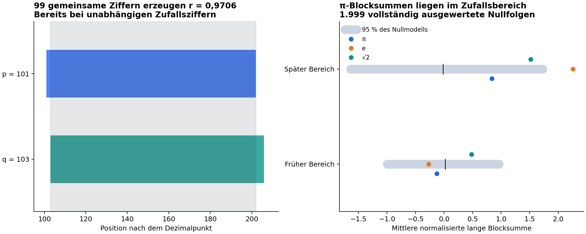

# π und Primzahlen als Ereignislog — neue automatisierte Untersuchung

Stand: 8. September 2026. **Ergebnis: In den untersuchten Regeln kein belastbares
zusätzliches Primzahlsignal und kein Faktorisierungsvorteil.** Die Untersuchung
liefert einen reproduzierbaren Datensatz, eine exakte Erklärung einer sehr starken
Scheinkorrelation und konkrete Grenzen für die nächste Forschungsfrage.
Keine Aussage für oder gegen RH; kein Normalitätsbeweis; kein allgemeiner
Unmöglichkeitsbeweis für Beziehungen zwischen π-Ziffern und Primzahlen.

## Was konkret gerechnet wurde

Zwei Millionen Nachkommastellen jeweils von π, e und √2; π erneut mit höherer
Präzision gerechnet und die erste Million vollständig mit dem veröffentlichten
[Angio-Datensatz](https://assets.angio.net/pi1000000.txt) verglichen. Beide Vergleiche
sind identisch. Hashes und Rechenzeiten stehen in `data_manifest.json`.

Index 1 ist die erste Nachkommastelle, also die 1 von 3.14159. Die führende 3 zählt
nicht. Führende Nullen bleiben in Blöcken erhalten. Zwei Interpretationen:

- B_p = d_p … d_(2p−1): p Ziffern ab Primzahlposition p.
- C_p = d_p … d_(p+ell(p)−1): so viele Ziffern wie die Dezimaldarstellung von p.

Die Hauptmessung umfasst 22.044 Primzahlen p≤250.000 und eine spätere Gegenprüfung
mit 29.400 Primzahlen 600.001≤p≤1.000.000. Auch die VOLLEN langen Blöcke der beiden
Gruppen greifen auf getrennte Ziffernbereiche zu. Die Gegenprüfung ist intern und
vor der neuen Rechnung festgelegt; π ist eine bekannte deterministische Konstante,
kein im wörtlichen Sinn zufällig gezogenes unabhängiges Experiment.

Pro Bereich 15 Messgrößen: Ziffernverteilung, Primlücke, mod-4-Klassen, lange
Blocksummen und deren Restklassen, kurze Blockzahlen, sechsstellige Primzahlen,
umgekehrte Wert/Positions-Korrelation und Selbstverweise. Die sechsstellige Regel
prüft ALLE entsprechenden Werte an den geprüften Positionen, nicht nur ausgesuchte
Internetmuster. Jede Messung läuft durch dieselbe Pipeline auf 1.999 vollständigen
Zufallsziffernfolgen, einschließlich aller Überlappungen. Holm-Korrektur über die
30 primären π-Tests; e/√2 sind deskriptive Vergleichsdatensätze.

## Primäre Ergebnisse

Der kleinste rohe π-p-Wert ist **0,065**. Alle 30 Holm-korrigierten Werte sind 1.
Das bedeutet fehlende Auffälligkeit in dieser Testfamilie, nicht bewiesene
Unabhängigkeit. Ein künstliches Signal (Ziffer 9 an Primzahlpositionen) wird in
beiden Bereichen erkannt, sogar nach Holm: jeweils p=0,03. Das belegt Empfindlichkeit
für diesen starken Effekt, keine umfassende Poweranalyse für subtile Mechanismen.

| Messung | Früher Bereich: Wert / rohes p | Später Bereich: Wert / rohes p |
|---|---:|---:|
| Mittlere Ziffer an Primzahlposition | 4.4943295 / 0.730 | 4.4857823 / 0.382 |
| Korrelation Ziffer / nächste Primlücke | 0.0086727126 / 0.194 | 0.0016134386 / 0.783 |
| Mittlere normalisierte lange Blocksumme | -0.12849003 / 0.802 | 0.83833328 / 0.331 |
| Primzahlanteil in C_p | 0.088141898 / 0.964 | 0.076156463 / 0.134 |
| Sechsziffern-Primanteil: Primposition minus alle Positionen | -0.0010579133 / 0.549 | -0.0019910374 / 0.183 |
| χ₋₄: extrahierter Primwert / Primposition | -0.0087804228 / 0.686 | 0.0057936716 / 0.798 |

Die vollständigen Ergebnisse, einschließlich aller Kontrollen und Nullstreuungen,
stehen in `primary_results.json` und `null_metrics.npz`. Die Rohmessungen in e und
√2 können ebenfalls gelegentlich klein ausfallende p-Werte produzieren; auch dort
überlebt in dieser Familie nichts die jeweilige Holm-Korrektur.

## Der wichtigste strukturelle Befund: Die Ausleseregel baut Korrelation ein

Für unabhängige uniforme Ziffern X_i haben die Summen S_p über B_p exakt

    Cov(S_p, S_q) = 8,25 · |[p,2p−1] ∩ [q,2q−1]|.

Mit Z_p=(S_p−4,5p)/sqrt(8,25p) folgt

    Corr(Z_p,Z_q) = Überlappung / sqrt(pq).

Bei p=101 und q=103 sind 99 Ziffern gemeinsam. Die Korrelation beträgt daher
**0,9706348836**, obwohl die Ziffern in diesem Modell vollkommen unabhängig sind.
Für q=p+g<2p gilt (p−g)/sqrt(p(p+g)), asymptotisch 1−3g/(2p).
Eine glatte Kurve oder sehr hohe Nachbarblock-Korrelation ist deshalb ohne weitere
Kontrolle bereits eine Eigenschaft der Ausleseregel. Sie ist keine neue Eigenschaft
von π. Die Formel wurde außerdem über eine unabhängig gebaute Inzidenzmatrix geprüft.



Die Ausleseregel kann als Inzidenzmatrix A der Primzahlfenster formuliert werden:
S=A d. Schon AAᵀ trägt die Primzahlabstände. Wer daraus Primstruktur zurückliest,
kann also die selbst eingespeisten Primzahlpositionen wiederentdecken. Das schließt
einen zusätzlichen Effekt in d nicht aus; genau diesen müsste ein Residuum gegen
das vollständige A-basierte Nullmodell zeigen.

## Die vollständigen p-stelligen Zahlen

Zusatzuntersuchung, klar getrennt von der primären Testfamilie: alle 168 Primzahlen
p≤997, mit 999 vollständigen Zufallsfolgen als Kontrolle. Die beiden primen π-Blöcke:

| p | Voller B_p | Status |
|---:|---:|---|
| 2 | 41 | prim |
| 7 | 6535897 | prim |

Alle übrigen getesteten π-Blöcke sind zusammengesetzt. Die allgemeine Routine
unterscheidet bewiesene und wahrscheinliche Primzahlen; beide tatsächlichen Treffer
haben GMP-Status 2 (definitiv prim). Der Nullmittelwert liegt bei 1,067 Treffern,
das zentrale 95%-Intervall bei 0 bis 3; für die beobachteten zwei Treffer p=0,564.
Nur bei p=3 und p=97 ist B_p durch p teilbar; auch das ist unauffällig (p=1).
Hier wird kein Primzahltest für sämtliche millionenstelligen B_p behauptet.

## Rückwärts von bekannten Ziffernfolgen zur Arithmetik

Die [Pi-Search Page](https://www.angio.net/pi/) dokumentiert Selbstverweise und
Suchketten. Die [Irrational Numbers Search Engine](https://www.subidiom.com/pi/)
bietet laut ihrer Oberfläche je zwei Milliarden Ziffern von π/e/√2 an. Diese
Dienste wurden als Quellen geprüft; die Messungen erfolgten lokal auf zwei Millionen
Ziffern. Der größere Webseitenbestand wurde nicht als durchsuchter Datensatz ausgegeben.

| Folge | Erste Position im lokalen Datensatz | Anzahl überlappender Treffer | Davon an Primpositionen |
|---|---:|---:|---:|
| `999999` | 762 | 5 | 0 |
| `888888` | 222299 | 1 | 0 |
| `235711` | 366753 | 3 | 0 |
| `112358` | 820389 | 5 | 0 |
| `314159` | 176451 | 3 | 0 |
| `16470` | 1602 | 23 | 0 |
| `44899` | 13714 | 17 | 1 |
| `424242` | 242422 | 6 | 0 |
| `240` | 1196 | 1975 | 169 |
| `480` | 104 | 2025 | 146 |
| `1024` | 12735 | 200 | 12 |
| `65536` | 106920 | 25 | 2 |
| `1048576` | nicht im Bereich | 0 | 0 |
| `123456` | nicht im Bereich | 0 | 0 |
| `0123456789` | nicht im Bereich | 0 | 0 |

Alle 27 vorab benannten Folgen wurden gegen 9.999 Verschiebungen der Primpositionsmaske
geprüft, bei erhaltenen Abständen zwischen ihren Treffern. Keine korrigierte
Primpositionsanreicherung. Die historischen Folgen sind bereits nach Auffälligkeit
in π ausgesucht: Dieser Auswahlbias verschwindet durch Holm nicht. Die Verschiebung
ist ein endliches Alignment-Nullmodell, kein Satz über die stationäre Primverteilung.
Die Faktoren jeder ersten Fundposition und sämtliche Treffer stehen in `reverse_results.json`.

**Selbstverweise:** Vollständiger Scan ergibt 1, 16470 und 44899. Dabei
16470=2·3³·5·61 und 44899=59·761; 1 ist ebenfalls keine Primzahl.
Ein Selbstverweis bedeutet nicht erste Fundstelle: „16470“ steht schon bei 1602,
„44899“ schon bei 13714. Diese beiden Begriffe werden auf Musterseiten leicht vermischt.
Unter unabhängigen Uniformziffern ist die erwartete Zahl primer Selbstpositionen
bis zwei Millionen exakt Σ_(p≤2M)10^(−ell(p)) ≈ 1,01868. Null beobachtete Treffer
sind daher keine Überraschung. Für alle k-stelligen Positionen erwartet man grob
0,9 Selbsttreffer pro vollständiger Größenordnung, nicht exponentiell viele.

**Suchketten:** Die erste Fundstelle von 169 ist 40, von 40 ist sie 70, und so weiter;
der bekannte 20er-Zyklus wird exakt reproduziert. 211→93→14→1→1 landet in einem
Fixpunkt. Für jede Bahn einer endlichen, überall definierten Selbstabbildung muss
irgendwann ein Zyklus entstehen. Unsere begrenzte Suche kann außerdem am Datenrand
enden. Das Vorhandensein eines Zyklus allein liefert somit keinen Primmechanismus.

**Indexkorrektur:** Die Anekdote zu „424242“ nennt auf Angio 242423. Unsere mit Angios
Millionendatei vollständig abgeglichene Rechnung findet bei der dort angegebenen
einsbasierten Nachkommazählung bereits **242422**. Gerade hier ist ein Positionsversatz
arithmetisch entscheidend; keine nachträglichen ±1-Korrekturen zur Erzeugung von Mustern.

## Abgleich mit dem aktuellen Forschungsstand

- **Frühere π-Arbeit:** `pi_prime_correlations.md` prüfte 100.000 Ziffern mit einem
  negativen Befund. r184/v942 dokumentiert darüber hinaus fünf π-basierte Ereignisfolgen,
  einschließlich Kettenbrüchen und BBP, ohne primespezifische Detektorauffälligkeit.
  Diese historischen Läufe wurden hier in den Quellen geprüft, nicht erneut ausgeführt.
- **RH:** Der aktuelle All-place/Tate-Bericht isoliert den Zeta-Faktor, lässt aber
  die globale Tate–Weil-Realisierung und unabhängige Positivität offen. Ein endlicher
  Ziffernscan liefert diese fehlenden Objekte nicht. Die RH bleibt auch nach dem
  [Clay-Status](https://www.claymath.org/problem/unsolved/) ungelöst.
- **Faktorisierung:** r643 weist den bedingten Sprung bei bekanntem Regulator nach.
  Der neuere r644 liefert `RELATIONS_RECOVER_REGULATOR_BASELINE`: Regulatorgewinnung
  über glatte Relationen und ganzzahlige Abhängigkeiten, als bekannter SIQS/Buchmann-
  Mechanismus klassifiziert. Die [Arbeit von Murru/Salvatori, v2 Januar 2025](https://arxiv.org/abs/2409.03486v2)
  macht die Zusatzinformation des Regulators ausdrücklich sichtbar.
- **Allgemeine Theorie bis 8. September:** Die lokalen Round50-Artefakte behalten
  Frequenzen mit ihren Strompräfixen gepaart und erhalten Vorzeichen; die neue
  geladene Kokzykelarbeit zeigt fehlende Zeicheninformation in einem gröberen
  Compilerquotienten. Für diese π-Untersuchung ist das eine methodische Lehre:
  Position, Wert, Vorzeichen, Reihenfolge und verlorene Information müssen explizit
  bleiben. Es entsteht daraus noch keine Herleitung einer Dezimalcodierung.
  Round50 ist lokale, teilweise bedingte NON-RH-Forschung, keine geschlossene TOE.

Gezielter externer Aktualitätsabgleich: [Guth–Maynard, April-2026-Version](https://arxiv.org/abs/2405.20552v2)
verbessert Nullstellendichten und Primzahlen in kurzen Intervallen; die Arbeit ist
2026 in den Annals erschienen. [Kahanamoku-Meyer/Ragavan/Van Kirk, Juli-2026-Version](https://arxiv.org/abs/2510.08432v3)
verbessert Ressourcen für Regevs Quantenfaktorisierung. Beide Fortschritte wurden auf
Relevanz geprüft; keiner liefert in der geprüften Darstellung einen π-Dezimaldecoder.
Dies ist ein gezielter Quellenabgleich, keine erschöpfende Sichtung sämtlicher
2026-Preprints oder Prüfung jeder behaupteten RH-Lösung.

## Faktorisierungsprobe mit ausschließlich N als Eingang

200 feste kleine Semiprime in den angeforderten Größenklassen 16–24 Bit (193
verschiedene N), je 32 sechsstellige Kandidaten aus π. Die Ausleseadresse benutzt
nur N und feste öffentliche Konstanten. Die Faktoren werden nur zur Erstellung und
Kontrolle der Testdaten verwendet. Verglichen werden exakt dieselben Adressen in
e, √2 und 999 vollständigen Zufallsströmen; doppelte N und überlappende Lesezugriffe
bleiben im endgültigen Nullmodell erhalten.

| Ziffernquelle | Eingaben mit gefundenem nichttrivialem Faktor |
|---|---:|
| pi | 14/200 |
| e | 24/200 |
| sqrt2 | 27/200 |
| Zufallsmodell, Mittel | 24.48/200 |

π verbessert diesen eingefrorenen ggT-Versuch nicht: einseitiges p für einen
Vorteil 0,995. Die geringe π-Ausbeute ist keine allgemeine Aussage, π sei als
Zufallsquelle schlechter; es ist eine einzelne begrenzte Testfamilie mit kleinen
Faktoren. Dies ist auch kein Lauf des Regulatoralgorithmus, keine RSA-Demonstration
und kein Nachweis einer asymptotischen Komplexität. Digitgenerierung, Adressregel,
Datenumfang und Zufallskosten sind mitprotokolliert.

## Wo die echte π–Prim-Verbindung liegt und welches neue Ergebnis zählen würde

Klassisch bestimmt das Eulerprodukt π über ζ(2)=π²/6; siehe
[NIST DLMF](https://dlmf.nist.gov/25.6). Die vollständige Zeta-Funktion enthält
π^(−s/2)Γ(s/2), siehe [DLMF 25.4](https://dlmf.nist.gov/25.4).
Numerisch liefert unser endliches ζ(2)-Produkt über Primzahlen bis eine Million
π≈3,1415925471279884. Das χ₋₄-Produkt liefert π≈3,141599411556697.
Das sind klassische positive Verbindungen, keine neuen Dezimalmuster.

Der mathematisch passende Ereignislog zur expliziten Formel besteht aus Ereignissen
bei k·log(p) mit Gewichten log(p), nicht allein aus ungewichteten Dezimalpositionen.
π gehört dort zur reellen/Fourier-/Gamma-Normalisierung. Eine neue Brücke müsste
nachweisen, wie ein π-Auslesemechanismus diese **Gewichte und multiplikativen
Beziehungen** ohne vorher eingespeiste Primantwort erhält. Die BBP-Formel extrahiert
binäre/hexadezimale π-Ziffern effizient im Speicher; sie liefert keine solche Brücke
([Originalarbeit](https://www.davidhbailey.com/dhbpapers/digits.pdf)).

Auch rechnerisch ist eine Grenze relevant: Wer einen Block von p Ziffern explizit
ausgibt, benötigt mindestens Ω(p) Ausgabearbeit, also exponentiell in der Bitlänge
von p. Für eine Faktorisierungsabkürzung muss eine kleine benötigte Funktion des
Blocks direkt berechnet werden. Unsere Summen benutzen deshalb Präfixsummen statt
sämtliche überlappenden Blöcke zu materialisieren. Dass π berechenbar ist, verbietet
keinen algorithmischen Vorteil; es stellt aber keinen kostenlosen neuen Oracle dar.

**Nächstes sinnvolles Gate:** Eine einzige konkrete Regel aus π und N muss eine
zuvor unbekannte regulatorbezogene Größe oder eine nichttriviale Kongruenz liefern,
dann auf neuen Semiprimen mit vollständigen Erzeugungs-/Suchkosten gegen gleiche
Zufallsbudgets bestehen. Für einen reinen Ziffernbefund wäre zuvor ein eingefrorener
Effekt mit Replikation in einem neuen, größeren Bereich nötig. Aktuell überlebt
keine der getesteten π-Regeln dieses vorgelagerte Signal-Gate.

## Reproduktion und Grenzen

Abhängigkeiten: Python, numpy, gmpy2, sympy; matplotlib nur für diesen Bericht.
Keine Änderungen an bestehenden Theorie-/Queue-/Paper-Dateien. Ergebnisse sind
lokale Forschungsartefakte. `source_manifest.json` enthält HEAD und Quellenhashes.

```sh
python3 probe.py
python3 supplement.py
python3 audit_resolution.py
python3 audit.py
python3 write_report.py
```

Diese Sitzung benutzte die vorhandenen Python-Pakete und gmpy2 separat unter
`/tmp/tfpt-pi-event-deps`; entsprechend `PYTHONPATH=/tmp/tfpt-pi-event-deps` setzen,
oder gmpy2 in der eigenen Forschungsumgebung installieren. `--reuse-data` spart
Neuberechnung/Download vorhandener Zifferndateien. Datenfiles werden vor Benutzung
über die separate Auditprüfung verifiziert; bei frischer Erzeugung außerdem über
Präzisionswiederholung und externen Millionenziffernvergleich.

63 unabhängige Checks prüfen Sieve gegen Sympy, direkte Stringauslese gegen die
Vektorrechnung, exakte χ₋₄-Behandlung inklusive p=2, Primtests, Kovarianzmatrix,
Testdaten und Hashes. Zusätzlich wird die Auflösung der Monte-Carlo-Korrektur geprüft.
Der erste 999-Lauf hatte eine zu grobe minimale zweiseitige p-Auflösung für 30 Holm-
Tests; die Erhöhung auf 1.999, eine korrekte χ₋₄(2)-Behandlung und das überlappungstreue
Faktorisierungsnullmodell sind offen in `PROTOCOL.md` dokumentiert. Vorläufige
Resultate bleiben in `preliminary_999/`; maßgeblich sind die finalen Dateien im
Hauptordner. Keine nachträgliche Auswahl eines vorteilhaften π-Signals.

Normalität von π ist nicht bewiesen; endliche Zufallstests ersetzen diesen Beweis
nicht ([Bailey et al., Normality and the Digits of π](https://www.davidhbailey.com/dhbpapers/normality-digits-pi.pdf)).
Dezimalbasis, endlicher Datenumfang, kleine Faktorinputs und begrenzte Testfamilie
sind die Reichweitengrenzen der vorliegenden Untersuchung.


## Durchgeführte Fortsetzung

Das anschließend autorisierte [π/N-Relationen-Gate](relation-gate/README.md) prüft
128 neue Semiprime bis 56 Bit über vollständige Quadratkongruenzen und Faktorzerlegungen.
Ergebnis: echte Faktoren, aber kein π-spezifischer Vorteil gegenüber Zufall oder
der klassischen Reihenfolge; 722 Erfolgszertifikate unabhängig verifiziert.


Die nächste [arithmetisch bedingte Gegenprüfung und Phasenanalyse](arithmetic-gate/README.md)
trennt den klassischen Siebeffekt von möglicher π-Zusatzinformation.

Der anschließende [Kostenvergleich exakter Fourier-Ereignisse mit einem modularen Wurzelsieb](spectral-cost-gate/README.md)
verwendet 128 weitere neue Semiprime und identische Kandidaten in allen Methoden.
Ergebnis: 124 verschiedene N zerlegt, aber kein Fourier-Kostenvorteil gegenüber
dem klassischen Sieb; 372 gespeicherte Zertifikate unabhängig verifiziert.

Die [Vorhersageprüfung auf neuen Ziffernbereichen](prediction-gate/README.md) erweitert
π, e und √2 auf je 10,4 Millionen Nachkommastellen und prüft die nächste
Primzahllücke außerhalb des Lernbereichs. Beide festen π-Modelle verschlechtern
die Vorhersage leicht; 999 vollständige Zufallsströme und eine erkannte
Positivkontrolle begrenzen die Aussage. Normalität allein würde Korrelationen
an Primzahlpositionen mathematisch nicht ausschließen.

Die [nichtlineare Suche mit getrenntem Auswahlbereich](nonlinear-gate/README.md)
untersucht anschließend 28 Ziffernpaare und sechs Dreierfolgen an neuen Positionen
zwischen 11 und 13,2 Millionen. Für π wird keine Korrektur ausgewählt, während
ein künstlich gemeinsam kodiertes Signal erkannt wird. Eine gefundene
Extrapolationsschwäche des arithmetischen Basismodells ist samt separater
nachträglicher Gegenprüfung dokumentiert; sie wird nicht als neue Replikation gezählt.
