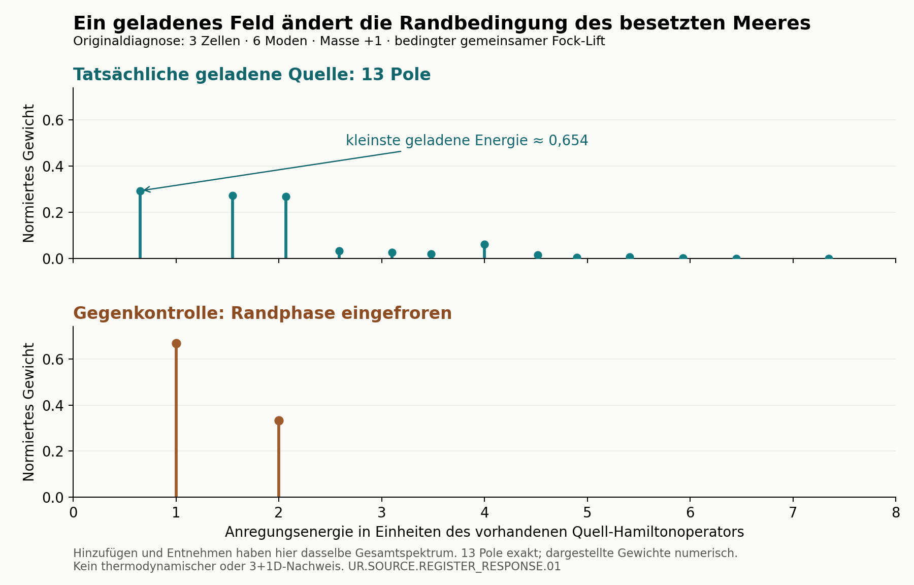

# Die gemeinsame Quelle reagiert auf eine Ladung als Ganzes

**UR.SOURCE.REGISTER_RESPONSE.01 — PARTIAL, 20. September 2026.**

Aus der neuen korrelierten Registerkodierung lässt sich die geladene Antwort
der bestehenden Quelle vollständig berechnen. Ein zusätzliches Teilchen
ändert zugleich die Randbedingung. Darauf reagiert das gesamte bereits
besetzte Meer. Der Zusammenhang folgt aus den ursprünglichen Quellmatrizen;
es wurde keine Kopplung an die native Hilfsbank angepasst.

Das Ergebnis gilt unter zwei wesentlichen Voraussetzungen: dem gemeinsamen
Fock-Lift der Einteilchenquelle und den von der anderen Lane konstruierten,
kanonisch vervollständigten Sharp-Arc-Feldern. Ihre physische Auswahl aus den
TFPT-Ursprungsprinzipien ist weiterhin offen.

## Was die Zusammenführung jetzt liefert

Die Register-Lane hatte eine exakte Feldkodierung und einen gemeinsamen
Hamiltonoperator angegeben. Hier sind dazu der tatsächliche Grundzustand,
die vollständige geladene Zeitantwort und die Antwort des bereits vorhandenen
Disorder-Operators berechnet. Das beseitigt eine konkrete Lücke innerhalb
dieses bedingten Quellansatzes: Zustand, Felder und Zeit werden gemeinsam
benutzt, statt nur gleiche Besetzungszahlen oder gleiche Dimensionen zu
vergleichen.

Im originalen kleinen Diagnosesystem mit drei Zellen, sechs Fermionmoden und
Masse +1 ergibt sich ohne neue Parameter:

| Größe | Aus derselben Quelle berechnet |
|---|---|
| Grundzustand | eindeutig; Register 2, drei besetzte negative Moden |
| Grundenergie | −4 |
| Kleinste globale Anregung | 4−√6−√2 ≈ 0,136296695 |
| Operator, der sie erreicht | vorhandener Disorder-Operator D bzw. D† |
| Gewicht dieser D-Anregung | exakt positive Radikalform; ≈ 0,752294532 |
| Kleinste geladene Anregung | 4−√(2+√3)−√2 ≈ 0,653934785 |
| Geladene Spektrallinien | exakt 13 verschiedene, alle mit positivem Gewicht |

Alle Energien stehen in den dimensionslosen Einheiten des bereits gewählten
Quell-Hamiltonoperators. Das sind keine vorhergesagten Teilchenmassen.

## Warum eine bloß freie Einteilchenantwort hier zu kurz greift

Das lässt sich schon mit einer exakten Zahl entscheiden. Summiert über die
sechs Felder hat die tatsächliche geladene Antwort das erste Energiemoment
**16/3**. Würde man die Randphase beim Hinzufügen oder Entnehmen einfrieren,
käme **4** heraus. Die Besetzungsgewichte wären in beiden Fällen gleich.
Besetzungen allein hätten den Unterschied also verborgen.

Die tatsächliche Antwort hat dreizehn Pole; die eingefrorene Antwort nur die
beiden Energien 1 und 2. Die Gewichte in der Grafik sind numerisch dargestellt.
Dass alle dreizehn Pole vorhanden sind, ist durch exakte Polynomrechnung
nachgewiesen. Die allgemeine Zeitformel beruht auf einer Slaterdeterminante
und ihrer Adjunkten und bleibt auch bei verschwindender Meerüberlappung gültig.

Das erklärt einen wichtigen Unterschied: Auf jedem festen Teilchenzahlsektor
ist die Quelle frei. Ein geladenes Feld verbindet aber verschiedene Sektoren
mit verschiedenen Randoperatoren. Deshalb ist die volle geladene Dynamik
nicht diejenige eines einzigen quadratischen Sechsmoden-Hamiltonoperators.
Eine lokale Kollision, attraktive Bindung oder Eichwechselwirkung ist damit
noch nicht hergeleitet.

## Was die anderen Lanes beitragen — und was offen bleibt

- **UR.SOURCE.CHARGED_REGISTER.01** liefert die korrelierte Kodierung. Ihre
  zuerst noch nicht zertifizierten Texte wurden eingefroren. Ihr anschließend
  fertiggestellter Checker wurde ebenfalls ausgeführt: alle 183 Kontrollen
  bestanden; normale, optimierte und ursprüngliche Ausgabe sind byteidentisch.
  Die hier verwendeten Gleichungen werden im eigenen Beweis nachvollzogen.
- **UR.SOURCE.STATIC_REGISTER.01** hatte den Produktzustand mit anschließendem
  Registertrace untersucht. Die jetzige Kodierung erhält das Register und
  benutzt andere geladene Felder; sie verletzt daher dessen Voraussetzungen
  gezielt und widerspricht dem früheren Ergebnis nicht.
- Die bisherigen Paar-/Grundantworten der **nativen Hilfsbank** liefern
  Vergleichsbedingungen. Sie legen nicht fest, welche Dynamik TFPT haben muss.
  Der jetzige Schritt berechnet deshalb die eigene Quellantwort.
- Die **Fluss-/E8-Lane** arbeitet mit zusätzlichen Kanälen und einem lokalen
  Eichkandidaten. Die globale C4-Ladung dieser Quelle ist kein Ersatz für
  deren lokales Gauß-Gesetz. Ein Übergang zwischen beiden ist noch offen.

Der fertige Beleg der anderen Lane setzt außerdem eine konkrete Grenze:
Bei fester Zylinderbreite und Beobachtungszeit nähert sich die neutrale lokale
Dynamik weit entfernt vom Schnitt der unveränderten freien Quelle. Bloßes
Vergrößern dieses Systems kann daher in diesem Grenzfall **keine neue lokale
Kraft im Inneren** liefern. Die dreizehn geladenen Linien bleiben ein Ergebnis
für die gemeinsame Rand-/Registerantwort.

Für die Gesamtlösung ist nun die entscheidende Herkunftsfrage genauer:
**Warum wählt die ursprüngliche TFPT-Quelle gerade diesen gemeinsamen
Vielteilchen-Lift und diese geladenen Felder als physische Objekte, und woher
kommt eine lokale Wechselwirkung jenseits dieses Randmechanismus?**
Für einen vollständigen Anschluss an das E8-/Flavor-Wörterbuch und dieselbe
elektromagnetische bzw. Clock-Normierung braucht es diese Herkunft.
Die endliche Rechnung allein schließt weder diesen Ursprung noch
die thermodynamische, lokale Eich- oder 3+1D-Brücke und damit keine T1–T8-Gates.

Beweis, Annahmen und exakte Spektralformel stehen in [PROOF.md](PROOF.md).
Die reproduzierbaren Resultate stehen in [certificate.json](certificate.json),
der Quellenstand in [source_manifest.json](source_manifest.json).
