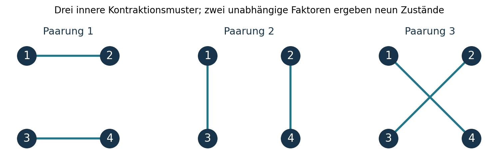

# Das Ergebnis in einfachen Worten

**Die wichtigste offene Verbindung liegt zwischen Schutz, innerer Referenz und tatsächlicher Benutzung.** Unsere Bausteine erfüllen jeweils Teile davon. Bisher gibt es keinen gemeinsamen Nachweis, dass dieselbe ursprüngliche Quelle alle drei Eigenschaften gleichzeitig trägt.

Ein Bild: Wir haben eine Nachricht, deren Papier einen bestimmten Schaden übersteht. Zum Lesen brauchen Absender und Empfänger aber dasselbe Alphabet. Das Alphabet war teilweise stillschweigend von außen vorgegeben. Daneben besitzen wir eine kleine, richtungsunabhängige „Uhr“. Ihre beiden Zustände sind jedoch gegen genau diesen Schaden nicht als Qubit geschützt. Beides zusammen ist noch kein selbstständig arbeitender Beobachter.

Das ist keine Widerlegung des bisherigen Codes. Es ist eine präzisere Angabe seiner Voraussetzungen. Insbesondere bedeutet fehlende innere Referenz nicht fehlende räumliche Orientierung: Es geht hier um die Gruppe $G=\mathrm{Spin}(10)\times SU(4)$ und ihre inneren Komponenten.

Diese Priorität betrifft unsere bisherige Operations- und Kommunikationsroute. Eine fundamentale Naturtheorie muss nicht gerade den 15er-Code oder diesen speziellen Modenverlust korrigieren. Fehlerkorrektur ist hier ein gewähltes Leistungsziel und ein strenger gemeinsamer Bausteintest, kein aus Einstein, Noether oder Dirac folgendes Naturaxiom.

**Eine konstruktive Alternative ist bereits sichtbar:** Information kann in verschiedenen Beziehungen zwischen mehreren Bausteinen liegen, obwohl der Gesamtzustand keine innere Richtung auszeichnet. Für vier unterscheidbare ursprüngliche Bosonbanken konstruieren wir neun linear unabhängige solche Zustände. Ihre Existenz und Symmetrie sind exakt geprüft. Ihre Präparation, dauerhafte Speicherung und gemeinsame Fehlerkorrektur unter der nativen Entwicklung bleiben offen.

Zugleich sollten wir das Endziel anders formulieren: Eine vollständige physikalische Theorie muss belastbare Gesetze und Vorhersagen liefern. Dass sie ohne Zustands- oder Randdaten genau ein mikroskopisches Universum auswählt, ist eine zusätzliche Forderung. Ebenso könnten mehrere verschiedene Mikromodelle dieselbe großskalige Physik besitzen. Diese Möglichkeit muss geprüft werden; die bisherigen endlichen Gegenbeispiele entscheiden sie nicht.

# Was an dieser Ergänzung neu ist

Die Grundlage sind die eingefrorenen Quellen der Synthese 1.0, die sechs Follow-ups 1.1 und die gemeinsame Quelle 1.2. Diese Ergänzung ist eine gezielte Untersuchung ihrer Grundlagen, keine neue vollständige Prüfung sämtlicher PDFs oder des aktuellen Repository-Zustands.

| Ergebnis | Einordnung |
|---|---|
| Der innere 15er-Code verliert ohne erhaltene gemeinsame $G$-Referenz seine Unterscheidbarkeit | Neue explizite Folgerung für den bestehenden Code; exakt unter dem genannten Prozessvertrag |
| Ein $N=2$-Zustandsvektor kann im betrachteten Fockraum kein $SU(4)$-Singulett sein | Anwendung der bekannten Zentrumsladung; zusätzlicher Prüfmaßstab für eine Eichinterpretation |
| Nativer zweidimensionaler $N=4$-Singulettblock | Schon in v1.6.2 vorhanden; hier unabhängig erneut geprüft |
| Derselbe Zweierblock korrigiert die bekannte Einmodenlöschung nicht als Qubit | Exakter gemeinsamer Schutztest |
| Neun unabhängige relationale Singuletts aus vier unterscheidbaren Bosonbanken | Expliziter statischer Kandidat, noch kein geschlossener Speicher |
| Quartischer Zusatz unsichtbar in $N\leq3$, sichtbar am $N=4$-Oszillator | Exaktes Gegenbeispiel zur Auswahl des vollen Gesetzes aus kleinen Sektoren |
| Kettendispersion und endliches Boost-Hindernis | Eng begrenzte Kontrollen für einen späteren relativistischen Grenzwert |
| Universelle großskalige Phase statt zwingend eindeutigem Mikrographen | Begründeter Forschungswechsel, bisher kein TFPT-Universalitätssatz |

Zwei Prüfer bestätigen **352 explizite Bedingungen**: 37 zur Grundlagenprüfung und 315 zum nativen Singulettblock und seinen Folgerungen. Die normale und die optimierte Ausführung stimmen bytegenau überein. Die Anzahl ist eine Dokumentation der ausgeführten Bedingungen, kein Maß für die Nähe zu einer Weltformel.

# Einstein: Welche Unterscheidungen sind physisch?

## Der methodische Maßstab

Einsteins Arbeit von 1905 beginnt bei der Bedeutung von Gleichzeitigkeit, Uhren und der Gleichwertigkeit gleichförmig bewegter Bezugssysteme. Das ist für uns ein konkreter Hinweis: Vor einer Vereinigung von Symbolen muss klar sein, welches Experiment ihre Bedeutung festlegt. Quelle: [Einstein, Über die Elektrodynamik bewegter Körper, englische Originalübersetzung](https://www.gutenberg.org/files/66944/66944-h/66944-h.htm).

Für TFPT folgt daraus als **eigene methodische Ableitung**: Eine innere Komponente, ein Banklabel, eine Uhrablesung und ein Ort dürfen nur dann gleichgesetzt werden, wenn dieselbe physische Konstruktion diese Bedeutung trägt. Ein frei gewähltes Koordinatensystem ist erlaubt. Eine damit zusätzlich bereitgestellte Referenz oder Steuerung muss als Ressource erscheinen.

## Der genaue Referenztest des 15er-Codes

Der helle $N=2$-Sektor einer Bank enthält die irreduzible innere Darstellung

$$R=(10,6),\qquad \dim R=60.$$

Im Dreieck der gemeinsamen Quelle besitzt der helle Sektor die Form

$$\mathcal H_{\mathrm{hell}}\cong\mathbb C^6\otimes R.$$

Der erste Faktor beschreibt die sechs Umwandlungs- und Kopiemöglichkeiten. Er ist kein bereits hergeleiteter Raum. Die bisherige logische Kodierung verwendet eine Isometrie $C:\mathbb C^{15}\to R$, also innere Information.

Angenommen, der Empfänger hat keine mit der Nachricht korrelierte innere Referenz und es stehen nur $G$-invariante Unterscheidungen zur Verfügung. Dann ist die relevante Gruppenmittelung

$$\mathcal T_G(\rho)=\int_G D(U)\rho D(U)^\dagger\,dU.$$

Schurs Lemma liefert für jedes $\rho_L$ mit Spur eins

$$\boxed{\mathcal T_G(C\rho_LC^\dagger)=I_{60}/60.}$$

Das gilt auch für kohärente Überlagerungen und gemischte logische Nachrichten. Bei demselben Zustand des äußeren Sechserfaktors verschwinden daher sämtliche Unterschiede zwischen den logischen Eingaben aus der referenzfreien Statistik. Sind Nachricht und weitere Systeme verschränkt, wirkt die Mittelung auf diesem irreduziblen Faktor als vollständig depolarisierender Kanal.

**Unabhängiges endliches Zertifikat.** Die 60 Gewichte bestehen aus zehn verschiedenen Vektorgewichten und sechs verschiedenen Farb-Paargewichten. Eine endliche Cartanmittelung trennt alle 60 Gewichte. Die Weylgruppen wirken transitiv auf den zehn beziehungsweise sechs Labels. Anschließendes Mitteln erzeugt deshalb dieselbe vollständige Mischung. Der Prüfer kontrolliert die Gewichtstrennung, die beiden Bahnen und die ursprüngliche Codeisometrie exakt.

Die Orientierung kann durch einen mitgeführten korrelierten Referenzzustand verfügbar werden. Dann darf man nur das gemeinsame System mitteln; relative Information kann erhalten bleiben. Ebenso kann ein operativ ausgewählter Hintergrund eine Referenz liefern. Beides muss konstruiert werden. Die bloße Invarianz von $H$ zwingt uns nicht, jeden Zustand unkorreliert zu mitteln. Der Satz betrifft den **ausdrücklich referenzfreien Vertrag**, nicht sämtliche Anwendungen des Codes. Zum physikalischen Rahmen siehe [Bartlett, Rudolph und Spekkens, Reference frames, superselection rules, and quantum information](https://arxiv.org/abs/quant-ph/0610030).

## Was das praktisch verändert

Ein zukünftiger Speicher muss zwei unterschiedliche Fragen beantworten:

1. Bleibt die Nachricht nach einem festgelegten Schaden rekonstruierbar?
2. Können interne Leser die verschiedenen Nachrichten ohne ein stillschweigend gewährtes Alphabet unterscheiden?

Der bisherige 15er-Code beantwortet die erste Frage für einen bekannten einzelnen Fermionmodenverlust. Für die zweite Frage benötigt er zusätzliche Referenzstruktur. Die Referenzfrage lässt sich weder durch mehr Tests desselben Fehlers noch durch die Größe des Hilbertraums beseitigen.

# Noether: Erhaltung wählt das Gesetz nicht aus

## Drei verschiedene Bedeutungen von Symmetrie

Noethers Theoreme verbinden Symmetrien eines Variationsproblems mit Erhaltungsbeziehungen und, bei passenden lokalen Symmetrien, Identitäten zwischen Bewegungsgleichungen. Diese Voraussetzungen sind wesentlich. Eine gegebene Darstellung einer Gruppe ist für sich noch keine hergeleitete Eichfeldtheorie. Quelle: [Noether, Invariant Variation Problems](https://arxiv.org/html/physics/0503066v3).

Im vorliegenden Modell sind mindestens drei Dinge auseinanderzuhalten:

- **Globale innere Symmetrie:** $[H,Q_a]=0$. Zustände dürfen dennoch innere Ladung tragen.
- **Fehlende gemeinsame Referenz:** Die erlaubte Statistik sieht nur geeignete invariante Kombinationen. Auch gemischte Zustände in nichttrivialen Darstellungen sind möglich.
- **Eine zusätzliche Gauss-Bedingung:** Ein isoliertes geschlossenes System soll $Q_a|\psi\rangle=0$ erfüllen. Das beschränkt die zulässigen Zustandsvektoren; zusätzliche Feld-, Fluss- oder Randfreiheitsgrade verändern diese Bedingung.

Diese drei Verträge sind nicht austauschbar. Insbesondere ist eine gruppeninvariante Dichtematrix nicht automatisch auf den Singulett-Unterraum beschränkt.

## Ein sehr kurzer Test gegen eine unbemerkte Eichannahme

Das Zentrumselement $iI_4\in SU(4)$ multipliziert einen ursprünglichen Fermion-Erzeuger mit $i$ und einen Boson-Erzeuger der Darstellung $\wedge^2 4=6$ mit $-1$. Daher wirkt es im ganzen Focksektor als

$$U(iI_4)|_{\mathcal H_N}=i^N I,\qquad N=N_f+2N_b.$$

Ein invariantes Zustandsket benötigt folglich $N=0\pmod4$. Bei $N=2$ ist die Wirkung $-I$, und die Projektion auf invariante Kets verschwindet bereits beim Mitteln über das Zentrum.

**Folge:** Wenn wir eine globale Singulett-Bedingung ohne zusätzliche kompensierende Freiheitsgrade einführen, ist der bisherige $N=2$-Informationssektor kein erlaubter geschlossener physikalischer Zustandsraum. Das widerlegt seinen Transporttest unter globaler Symmetrie nicht. Es widerlegt den ungeprüften Wechsel zu einem anderen Zustandsvertrag. $N=0\pmod4$ ist lediglich notwendig, nicht hinreichend.

## Ein unsichtbarer zusätzlicher Wechselwirkungsterm

Die ursprüngliche Bank verwendet

$$H=\Delta N_b+gX,\qquad
X=\sum_A(b_A^\dagger P_A+P_A^\dagger b_A).$$

Betrachte als **Gegenmodell**

$$\boxed{H_\eta=H+\eta N_b(N_b-1),\qquad \eta\geq0.}$$

Der Zusatz erhält $G$ und $N$. Er ist quartisch in den Bosonoperatoren. Bei mehreren Banken kann dieselbe lokale Regel als Summe über deren Bosonzahlen verwendet werden. Für $N\leq3$ gilt $N_b\in\{0,1\}$; dort ist der Zusatz identisch null. Alle Prozesse, die vollständig in diesen Sektoren bleiben, sind deshalb unter $H$ und $H_\eta$ gleich — für alle Zeiten, nicht nur bis zu einer Näherungsordnung.

Eine ausdrücklich gesetzte Beschränkung auf kubische Wechselwirkungen schließt diesen Zusatz definitionsgemäß aus. Die Frage ist dann, welches physikalische Prinzip diese Beschränkung begründet und unter einer späteren effektiven Beschreibung stabil hält. **Noether-Erhaltung und die erfolgreichen kleinen Sektoren allein tun dies nicht.**

Eine Schrödinger-Wirkung $S=\int dt\,[i\langle\psi|\dot\psi\rangle-\langle\psi|H_\eta|\psi\rangle]$ kann für jedes $\eta$ formuliert werden. Sie macht den Variationsrahmen explizit, wählt aber keinen dieser Parameterwerte aus.

# Eine native, richtungsunabhängige Dynamik — und ihre Grenze

## Der bekannte Singulettblock unabhängig nachgerechnet

Die Quelle v1.6.2, hier als S048 eingefroren, enthält bereits einen exakt geschlossenen Zweierblock bei $N=4$. Wir prüfen ihn erneut direkt am ursprünglichen $W$; seine Existenz ist **keine neue Entdeckung dieser Ergänzung**.

In der verwendeten Gewichtsbasis besitzt $R$ eine symmetrische orthogonale invariante Form $J$. Sie paart entgegengesetzte Spin-Vektorlabels und komplementäre Farbpaare einschließlich des Epsilon-Vorzeichens. Definiere

$$|B\rangle=\frac{1}{\sqrt{120}}\sum_{A,B}J_{AB}b_A^\dagger b_B^\dagger|0\rangle,$$

$$|F\rangle=\frac{1}{\sqrt{480}}\sum_{A,B}J_{AB}P_A^\dagger b_B^\dagger|0\rangle.$$

Beide sind $G$-Singuletts. Der Prüfer kontrolliert die vollständigen 45 Spin- und 15 Farbgeneratoren, die Quelltensor-Kovarianz und die invariante Form. Die Rohzustände besitzen Normquadrate 120 beziehungsweise 480. Alle Ausgänge in vier Fermionen heben sich mit ihren CAR-Vorzeichen exakt auf; 960 potenzielle Besetzungskonfigurationen wurden vollständig kontrahiert.

Es folgt in der normalisierten Basis $(B,F)$

$$\boxed{H_4=\begin{pmatrix}2\Delta&4g\\4g&\Delta\end{pmatrix}.}$$

Aus dem gewährten Anfangszustand $B$ schwingt die innere symmetrieneutrale Bosonzahl nach

$$\langle N_b(t)\rangle_B
=2-\frac{64g^2}{\Delta^2+64g^2}
\sin^2\!\left(\frac{t}{2}\sqrt{\Delta^2+64g^2}\right).$$

Das ist ein nativer Oszillator in der ursprünglichen Bank. Eine selbstständige Initialisierung, ein auslesendes Gerät und eine Herleitung der physischen Zeit sind damit nicht gegeben. Seine Periodizität allein erlaubt auch keine unbegrenzt eindeutige Zeitablesung.

## Warum derselbe Block noch kein geschützter Speicher ist

Für jede der 64 Fermionmoden ergibt die direkte Kompression

$$P_4n_rP_4=\begin{pmatrix}0&0\\0&1/32\end{pmatrix}.$$

Diese Matrix ist auf dem logischen Zweierblock nicht skalar. Der Modenverlust kann deshalb die beiden Besetzungsanteile unterscheiden und verletzt die notwendige Knill-Laflamme-Bedingung für die Korrektur einer bekannten einzelnen Modenlöschung als beliebiges Qubit. Die Prüfung erfasst alle 64 Moden.

Der Befund ergänzt den Referenztest: Ein inneres Singulett löst das Referenzproblem, aber nicht automatisch das Fehlerproblem. Ein für Umwandlung geeigneter Freiheitsgrad ist nicht automatisch ein dauerhafter Zeiger.

## Derselbe Oszillator unterscheidet die größere Theorie

Auf genau diesem Block wirkt der zuvor eingeführte quartische Zusatz als

$$H_{4,\eta}=\begin{pmatrix}2\Delta+2\eta&4g\\4g&\Delta\end{pmatrix}.$$

Die Schwingungsfrequenz wird

$$\Omega_\eta=\sqrt{(\Delta+2\eta)^2+64g^2}.$$

Bei derselben Präparation $B$ und derselben neutralen Schlussmessung $N_b$ unterscheiden sich die beiden Statistiken bereits durch

$$\langle N_b(t)\rangle_{\eta}-\langle N_b(t)\rangle_0
=\frac{16}{3}g^2\eta(\Delta+\eta)t^4+O(t^6).$$

Für $g\neq0$, $\Delta>0$ und $\eta>0$ ist der Koeffizient positiv. Das ist ein konkreter Auswahltest: Der Zweiladungssektor kann $\eta$ nicht sehen; der alte Vierladungsblock kann es. Es handelt sich um eine Modellvorhersage unter gewährter Präparation und Messung, nicht um ein ausgeführtes Naturexperiment.

# Der relationale Kandidat: Information ohne ausgezeichnete innere Richtung

## Konstruktion aus vier Bosonbanken

Betrachte vier unterscheidbare bereits zugelassene Bosonbanken, jeweils mit genau einem Boson. Das ist bei der Kompositionsregel 1.2 auf einem Graphen mit mindestens vier Kanten verfügbar; ein einzelnes Dreieck hat dafür zu wenige verschiedene Banken. Die Bankauswahl bleibt eine zusätzliche äußere Struktur.

Die Darstellung $(10,6)$ ist reell. In passenden orthonormalen reellen Basen bezeichnen $a=1,\ldots,10$ und $\alpha=1,\ldots,6$ die beiden Faktoren. Für vier Träger gibt es drei Paarungen:

$$p_1=(12)(34),\qquad p_2=(13)(24),\qquad p_3=(14)(23).$$

Für jede Paarung $p$ im Zehnerfaktor und jede Paarung $q$ im Sechserfaktor setze

$$|p,q\rangle=\frac1{60}\sum_{a_1\ldots a_4,\alpha_1\ldots\alpha_4}
\delta_p(a)\delta_q(\alpha)
\prod_{r=1}^{4}b_{r,a_r\alpha_r}^\dagger|0\rangle,$$

wobei etwa $\delta_{p_1}(a)=\delta_{a_1a_2}\delta_{a_3a_4}$. Jeder dieser neun Zustände ist ein globales $G$-Singulett. Die beiden Paarungsmuster müssen nicht gleich sein. Genau dieser unabhängige Spielraum erzeugt neun statt drei Kandidaten.

## Exakte Unabhängigkeit

Die normierte Gram-Matrix der drei Paarungen in Dimension $d$ ist

$$G_d=(1-1/d)I_3+(1/d)\mathbf1\mathbf1^T.$$

Der Prüfer baut die vollständigen Kronecker-Delta-Tensoren bei $d=6,10$ auf und prüft alle Generatoren der jeweiligen orthogonalen Gruppe. Für die neun Zustände gilt

$$G_9=G_{10}\otimes G_6,$$

mit dem Spektrum

$$\operatorname{spec}(G_9)=\{8/5\;(1),\;6/5\;(2),\;1\;(2),\;3/4\;(4)\}.$$

Alle Eigenwerte sind positiv. Die neun Zustände sind daher linear unabhängig und können orthonormalisiert werden. Beliebige Superpositionen ihres Spanns bleiben globale Singuletts. Die Information liegt in unterschiedlichen gemeinsamen Kontraktionsmustern, nicht in einer einzeln lesbaren inneren Orientierung.

## Was damit noch nicht gelöst ist

Bei der anfänglichen reinen Bosonbelegung sind sämtliche Fermionmoden leer. Deren sofortiges Löschen stört diese Zustände nicht. Das wäre jedoch ein zu schwacher Schutztest.

Unter der nativen Kopplung entstehen Fermionpaare. Für einen normierten Zustand mit einem Boson in jeder der vier verschiedenen Banken gilt auf Fermionvakuum

$$\langle H\rangle=4\Delta,\qquad
\|(H-4\Delta)|\psi\rangle\|^2=32g^2.$$

Begründung: Jede annihilierte Bosonbank hinterlässt eine andere Dreifachbelegung; diese vier Ausgänge sind orthogonal. Für jeden gilt der ursprüngliche Paar-Gram $WW^\dagger=8I$. Bei $g\neq0$ verlässt die Entwicklung deshalb den reinen neun-dimensionalen Anfangsraum. Die Singulett-Eigenschaft bleibt bei $G$-invariantem $H$ erhalten, aber daraus folgt weder die Schließung dieses kleinen Raums noch Fehlerkorrektur zu späteren Zeiten.

Auch globale innere Invarianz beseitigt die gewählte Bankadressierung nicht. Der Kandidat löst eine konkrete Referenzfrage und keine vollständige relationale Raumkonstruktion. Invariante Projektoren zum mathematischen Unterscheiden existieren; ihre Erzeugung und Auslesung durch die ursprünglichen Wechselwirkungen sind noch nicht nachgewiesen.

# Dirac: Eine Zweiermatrix ist noch keine relativistische Materie

Diracs Formulierung relativistischer Dynamik verlangt eine gemeinsame Struktur von Energie, Impulsen, Drehungen und Boosts. Eine passende Entartung oder eine formal lineare Gleichung allein ersetzt diese Struktur nicht. Quelle: [Dirac, Forms of Relativistic Dynamics](https://journals.aps.org/rmp/abstract/10.1103/RevModPhys.21.392).

## Eine exakte kleine Kontrolle

Im vorgeschriebenen unendlichen eindimensionalen Kettennetz aus 1.2 besitzt der helle Zweiladungssektor

$$B(k)=8+4\cos k,\qquad
E_\pm(k)=\frac{\Delta\pm\sqrt{\Delta^2+4g^2B(k)}}2.$$

Am Minimum des unteren Bandes folgt

$$E_-(k)-E_-(0)
=\frac{2g^2}{\sqrt{\Delta^2+48g^2}}k^2+O(k^4).$$

Dieser konkrete Sektor besitzt dort keinen linearen Kegel. Das schließt eine andere Phase, andere Hintergründe oder andere Graphfolgen nicht aus. Auch ein massives relativistisches Teilchen hat im nichtrelativistischen Grenzfall eine quadratische Anregungsenergie. Der Test beweist deshalb lediglich: Dieser Ausdruck liefert die gewünschte Dirac-Struktur nicht bereits von selbst.

## Warum der endliche Code die vollständigen Boosts nicht tragen kann

Seien $H,P,K$ endliche hermitesche Matrizen, die in Einheiten $c=\hbar=1$ die beiden Relationen

$$[K,H]=iP,\qquad [K,P]=iH$$

exakt erfüllen. Zyklizität der Spur liefert

$$i\operatorname{tr}(H^2)
=\operatorname{tr}(H[K,P])
=\operatorname{tr}([H,K]P)
=-i\operatorname{tr}(P^2).$$

Positivität beider Quadrate erzwingt $H=P=0$. Ein nichttriviales endliches geschlossenes Code-System kann diese Boostrelationen folglich nicht exakt als unitäre Raumzeitdarstellung realisieren. Das ist eine bekannte Art endlicher Darstellungsobstruktion, hier als kurzer Prüfmaßstab ausgeschrieben. Ein einzelnes Matrixbeispiel im Rechner kontrolliert nur die Spurumordnung; der allgemeine Beweis ist das Argument oben.

Die physikalische Alternative ist ein geeigneter unendlicher Grenzwert mit kontrollierten Operatorbereichen oder eine ausdrücklich quantifizierte approximative Darstellung. Die endliche Dimension von Dirac-Gammamatrizen widerspricht dem Satz nicht: Raumzeit-Wellenfunktionen und Impulse leben dort nicht in einem insgesamt endlichen Hilbertraum.

Die schon früher geprüften Feldtyp- und Anomaliebedingungen bleiben zusätzlich bestehen. Insbesondere war die bedingte $SU(4)^3$-Anomalie für die Interpretation aller $(16,4)$ als gleichhändige vierdimensionale Weylfelder bereits in S074 behandelt. Sie ist keine neue Entdeckung dieser Ergänzung und wird hier nicht als Fehler des ursprünglichen endlichdimensionalen Fockmodells ausgegeben.

# Welche Einfachheit wir tatsächlich suchen sollten

## Die Eindeutigkeit des Mikromodells ist eine zusätzliche Frage

Petersen-Graph und fünfeckiges Prisma widerlegen in 1.2 die Auswahl eines eindeutigen endlichen Prozesses allein durch die dortigen Symmetrie- und Regelmäßigkeitsbedingungen. Daraus folgt nicht, dass jede weitere physikalische Aussage bis zur Auswahl genau eines Graphen unmöglich ist.

In einer großskaligen Theorie könnten Unterschiede irrelevant werden. Wilsons Renormierungsgruppe gibt hierfür einen präzisen Rahmen: Verhalten unter Skalenänderung, Fixpunkte und die Rolle zusätzlicher Variablen. Quelle: [Wilson, Renormalization Group and Critical Phenomena I](https://journals.aps.org/prb/abstract/10.1103/PhysRevB.4.3174). Die Anwendung auf TFPT ist eine Forschungsaufgabe; ein entsprechender Fixpunkt wurde hier nicht berechnet.

Ein sinnvoller neuer Vergleich benötigt deshalb ganze Graphfolgen und denselben Zustandsvertrag. Er muss zeigen, ob normierte Antwortfunktionen, Dispersionsrelationen und relevante Kopplungen konvergieren. Zwei kleine Graphen mit verschiedenen Spektren entscheiden diese Frage nicht. Ebenso bedeutet ein positives Ergebnis für eine eigens gewählte dreidimensionale Folge noch keine Auswahl von drei Dimensionen.

## Ein Gesetz muss nicht seine gesamte Anfangsbedingung bestimmen

Der bewiesene Grundzustand eines bestimmten Hamiltonoperators ist eine mathematische Aussage über diesen Operator. Seine Rolle als physikalischer Zustand des Universums ist eine weitere Aussage. Eine vollständige Theorie kann Zustands- oder Randdaten als Eingabe benötigen und dennoch weitreichende Vorhersagen machen.

Umgekehrt liefert ein einzelner stationärer Grundzustand keine wechselnden unbedingten Zeigererwartungen. Relationale Korrelationen innerhalb eines stationären Gesamtzustands bleiben möglich; sie sind mit einer konkret konstruierten Uhr und dem zugehörigen Auslesevertrag zu prüfen. Weder „Grundzustand existiert“ noch „Zeitkorrelation existiert“ ersetzt diese Arbeit.

## Der präzisierte Kandidat für das Gesamtbild

Eine sparsame Zielstruktur wäre

$$\boxed{\begin{gathered}
\text{Algebra und Dynamik}\\
\downarrow\\
\text{physikalische Phase und relative Information}\\
\downarrow\\
\text{interne Uhren, Eingriffe und Aufzeichnungen}\\
\downarrow\\
\text{großskalige Raumzeitvorhersagen}
\end{gathered}}$$

Dabei ist die Zerlegung

$$\mathcal H=\bigoplus_\lambda V_\lambda\otimes M_\lambda$$

weiterhin nützlich: $V_\lambda$ trägt innere Transformationseigenschaften, $M_\lambda$ zählt unabhängige Arten ihres gemeinsamen Auftretens. Diese Multiplizitätsidee war bereits in S074 vorhanden. Neu ist hier ihr verbindlicher Bezug zum Referenz- und Fehlerschutztest. Ein großes $M_\lambda$ allein ist weder ein Raum noch ein benutzbarer Speicher.

Die sparsame Leitidee lautet somit: **Physische Nachrichten durch intern unterscheidbare Beziehungen definieren und alle dafür erforderlichen Ressourcen im selben Modell mitführen.** Das ist ein Arbeitsprinzip, keine bewiesene fundamentale Naturgleichung.

# Der wirksamste nächste Versuch

## Ein gemeinsamer Nachweis mit mindestens zwei Nachrichten

Das nächste Ziel sollte klein genug sein, um streng zu scheitern oder zu bestehen:

**In einem einzigen festgelegten nativen Prozess zwei orthogonale relationale Nachrichten präparieren, unterscheiden und gegen einen bekannten einzelnen Modenverlust zu vorab festgelegten Entwicklungszeiten korrigieren.**

Die Anforderungen werden vor der Rechnung festgelegt:

1. **Ein Gesamtvertrag.** Hamiltonoperator, Graph oder Einzelbank, Anfangszustand, innere Referenzen und erlaubte Kopplungen ausdrücklich nennen. Die Herkunft jeder zusätzlichen Wahl sichtbar lassen.
2. **Ein physisch sinnvoller Informationsfaktor.** Mit dem bekannten $N=4$-Block und dem statischen Vier-Banken-Singulettkandidaten beginnen. Den von $H$ tatsächlich erzeugten invarianten Raum bestimmen, statt nur den Anfangsraum zu projizieren.
3. **Gemeinsamer Schutztest.** Für die kodierten Nachrichten die Fehler-Grams $P E_a^\dagger E_bP$ berechnen. Eine Prüfung nur bei leerem Fermionvakuum reicht nicht. Unbekannte Fehlerzeit und Fehler während der Korrektur wären spätere, stärkere Verträge.
4. **Native Unterscheidung.** Eine unterschiedliche unbedingte Zeigerstatistik nach derselben Entwicklung nachweisen. Ein frei gewährter Projektor auf die gewünschte Nachricht zählt nur als bedingter Zwischenschritt.
5. **Ehrliches Ergebnis.** Bei Scheitern den ersten verletzten Zusammenhang angeben. Bei Erfolg erst danach vergrößern und prüfen, welche der Aussagen unter Störungen und Skalenänderungen bestehen bleibt.

Daneben dient der alte Vierladungs-Oszillator als günstiger Auswahltest für symmetrieverträgliche zusätzliche Terme. Ein großer neuer Grundzustandslauf ist für die Entscheidung zwischen $H$ und $H_\eta$ zunächst nicht nötig.

## Was einen Durchbruch ausmachen würde

Ein wirklicher Fortschritt wäre ein gemeinsamer Satz über **Referenz, Fehler, Entwicklung und Auslese**, der bisher getrennte Zusatzannahmen eliminiert. Danach folgt die deutlich größere Aufgabe: robuste Grenzwerte auf einem physisch begründeten Hintergrund, relativistische Transformationsgesetze, konsistente chirale Felder und gravitative Vorhersagen.

Es gibt aktuell keinen Nachweis, dass diese Kette vollständig schließt. Die Untersuchung liefert aber einen genaueren Grund, warum bloßes Vergrößern der bisherigen Konstruktion nicht genügt, und einen expliziten relationalen Kandidaten, an dem die entscheidende Verbindung als Nächstes getestet werden kann.

# Nachprüfbarkeit und Quellen

Die eigenen Aussagen sind oben jeweils mit Voraussetzungen und Grenzen versehen. Der N=4-Block wurde nicht als neu ausgegeben. Die allgemeine Schur-Aussage, das endliche Boost-Hindernis und die Ausbreitungsdeutung werden nicht aus einer Anzahl bestandener Matrixchecks abgeleitet.

Das beigefügte Prüfpaket enthält beide ausführbaren Prüfer, die eingefrorenen numerischen Eingaben, die normalen und optimierten Protokolle, das native Singulett-Zertifikat, dieses Dokument und ein SHA-256-Manifest. Historische Bezugspunkte sind S048 v1.6.2, S074 v1.6.7 mit Nachtrag, Follow-ups 1.1 und gemeinsame Quelle 1.2. Die verwendeten Kopien liegen ebenfalls im Paket. Nicht behauptet werden eine erneute vollständige Grundzustandsprüfung, ein Experiment an der Natur oder ein vollständiger Theoriebeweis.

Die externen Quellen sind Primärarbeiten beziehungsweise eine fachliche Forschungsübersicht ihrer Autoren. Sie begründen die genannten methodischen und mathematischen Rahmen. Die spezifischen TFPT-Folgerungen und Kandidaten in dieser Ergänzung sind eigene Ableitungen aus den lokal geprüften Modellannahmen.
